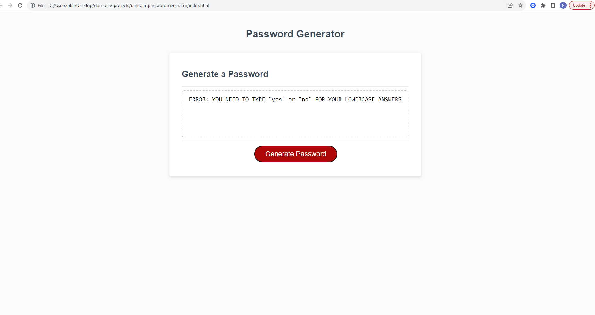

# random-password-generator

## Description

A website that creates a random password for the user based on certain edge conditions that the user specifies

## Installation

N/A

## Usage

Click the red button and then follow the prompts/confirms to set your edge conditions. The JS code will then output your new unique password to the page text area. 

## License

MIT

## Credits

UDenver Bootcamp Course

## Website Screenshot
[Nick Fillip's Portfolio LINK](nfillip.github.io/fillip-portfolio/)

